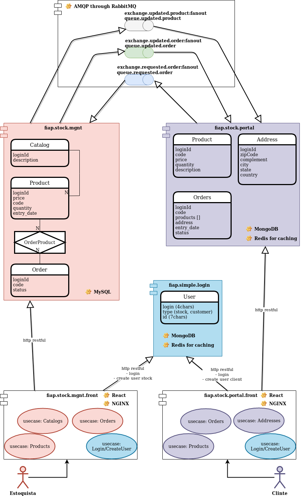

# 1 - intro

O projeto em questão atende ao trabalho para avaliação da disciplina **Microservice Development**, que compreende o
 desenvolvimento de um aplicativo desenvolvido em módulos separados porém que deve atender uma demanda em comum no fim.

A minha escolha foi o desenvolvimento de um exemplo fitício da gerencia de um estoque, a apresentação deste estoque em
 um portal, a solicitação de pedidos/compras neste portal, a integração entre o atendimento por parte do estoquista,
 confirmando ou rejeitando pedidos de clientes. 

#

###### Escola: FIAP
###### Curso: MBA FULLSTACK DEVELOPER, MICROSERVICES, CLOUD & IoT
###### Matéria: MICROSERVICES DEVELOPMENT
###### Prof.: ANDRE PONTES SAMPAIO
###### Aluno / RM: JEAN BRUNO SOUTO VILLETE / 335435

#
 
O módulo **fiap.sample.login** detém microserviços que atendem requisições REST, onde o estado é mantido num banco de
 dados MongoDB, e há uma camada de cache com Redis.

O único serviço exposto é a gerência de registros de usuário e seu tipo, onde também se atende uma requisição de login,
 devolvendo um identificador que é válido dentro do estoque e portal.

#

O módulo **fiap.stock.mgnt** mantém serviços CRUD para o domínio de Catálogo e Produtos, além da integração necessária
 com pedidos efetuados via **fiap.stock.portal**, que chegam no estoque e o estoquista podem confirmar ou rejeitar estes
 pedidos.

Este módulo é totalmente persistido no banco de dados MySQL, com modelo transacional e constraints, onde os dados estão
 normalizados e estruturados tabularmente.

A integração entre cadastro de produtos no estoque e apresentação no portal, de pedidos no portal e recebimento no
 estoque, além da aprovação destes pedidos no estoque (que devem ser atualizado nos registros de pedidos no portal) é
 feita via mensageria RabbitMQ.

#

Módulo **fiap.stock.portal** tem como objetivo oferecer serviços para o cliente do portal, como a navegação e
 visualização de produtos, solicitação de pedidos e depois o acompanhamento destes pedidos.
 
Este módulo mantém as informações num modelo não normalizado, mantido no banco de dados MongoDB, com seus os produtos e
 pedidos, além de um CRUD para os endereços dos clientes, que é depois utilizado nos próprios pedidos.

---

# 2 - execução com docker/docker-compose

Após o clone local, e toda alteração que for necessária, rode o script build que monta tanto os componentes de backend
 quanto frontend e gera as suas imagens docker localmente.
 
``` $ ./build.sh ```

#### subindo componentes backend separadamente localmente, com imagens docker locais
``` $ docker-compose -f docker-compose-local-backend-only.yml up ```

#### subindo componentes frontend separadamente localmente, com imagens docker locais
``` $ docker-compose -f docker-compose-local-frontend-only.yml up ```

#### subindo componentes backend junto com frontend localmente, com imagens docker locais
``` $ docker-compose -f docker-compose-local.yml up ```

#### subindo componentes backend junto com frontend, com imagem docker publica
``` $ docker-compose up ```

---

# 3 - diagrama de componentes e caso de uso

